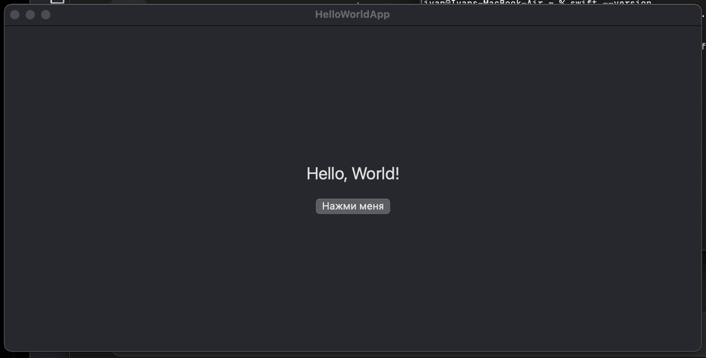

# HelloWorldApp

A macOS SwiftUI app with a button that switches the label between "Hello, World!" and "Привет!". Built entirely with Swift Package Manager, no Xcode project.



## Requirements

- macOS 12+
- Xcode Command Line Tools (Swift 5.9+)

## Install via Homebrew

```bash
brew tap PavlovIvan1/macos-app https://github.com/PavlovIvan1/MacOS-app.git && brew trust pavlovivan1/macos-app && brew install macos-app
```

Installs into `/Applications`, shows up in Launchpad/Spotlight. The cask builds the binary from source on your machine instead of downloading a prebuilt one, so Gatekeeper doesn't block it and no notarization is required.

## Build from source

```bash
git clone git@github.com:PavlovIvan1/MacOS-app.git
cd MacOS-app
swift run
```

## Build a `.app` bundle

```bash
./build_app.sh
open HelloWorldApp.app
```

## License

MIT — see [LICENSE](LICENSE).
